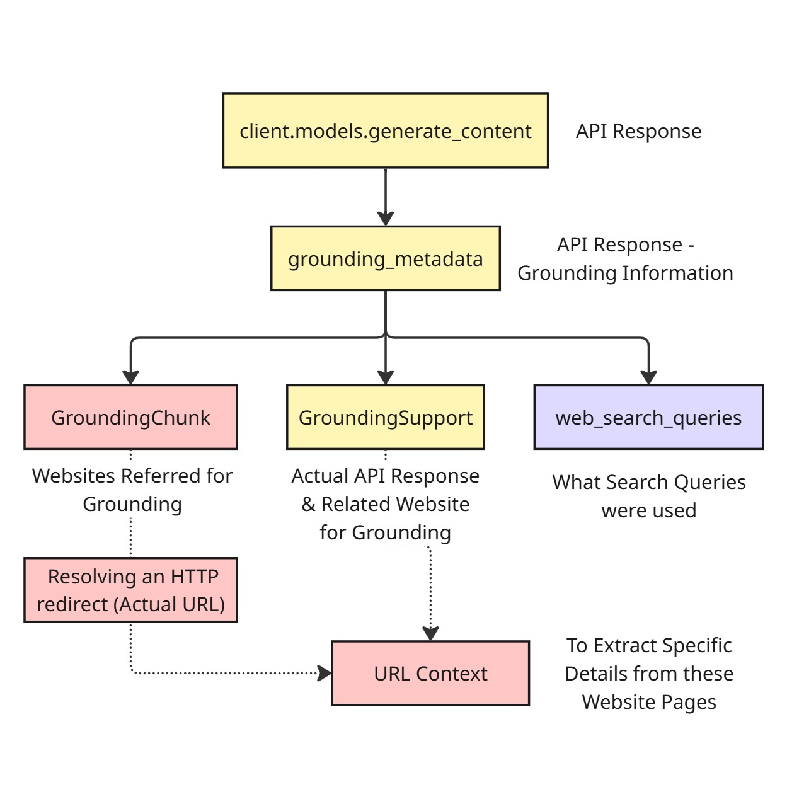

Correct Citations with Gemini Grounding Metadata

When working with ChatGPT or Gemini, one common frustration is broken or misleading citations. Sometimes links appear fine but lead to unrelated or error pages, which makes it difficult to build reliable tools and real products.

This repository demonstrates how to extract correct citations from Gemini API responses using grounding metadata.

---

## 📊 Flow Diagram

Here’s the high-level flow of how citation extraction works:

---

🔍 Problem

Links provided directly by LLMs are often unreliable.

Gemini provides a "Grounding Search" option in AI Studio and Vertex AI, but what I needed was direct API response citations.

The challenge: Gemini returns grounding metadata, but the URLs are Vertex AI Search redirect URLs rather than the actual sources.

⚙️ Solution

Gemini’s API response contains a groundingMetadata object with three important parts:

Grounding Chunk – websites referred to in the response.

Grounding Support – model response linked to grounding chunks.

Web Search Queries – search queries Gemini used to fetch results.

To map citations correctly:

Extract grounding indexes from the Grounding Support section.

Match them to sources in Grounding Chunks.

Resolve the Vertex AI redirect URL to get the real URL.

Use this final URL for frontend citations.

📖 Additional Notes

Gemini also provides a URL Context Tool to extract content directly from a resolved URL.

⚠️ One limitation: if you request a JSON-optimized response, Gemini doesn’t return grounding metadata (to be confirmed).

📂 Repo Contents

Platform_Search_Grounding.ipynb → Jupyter notebook with step-by-step code.

README.md → This file.
